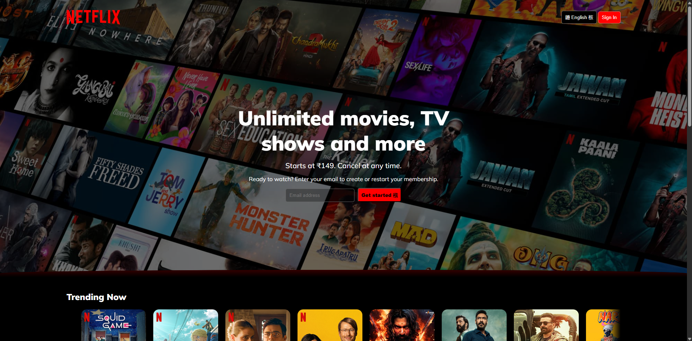

# 🎬 Netflix Clone (Frontend)

A responsive **Netflix web homepage clone** built with pure **HTML & CSS**, mimicking the real Netflix UI. This project focuses on clean structure, visual polish, and responsiveness — perfect for learning frontend design fundamentals.

---

## 🔥 Features

- 🎨 Fullscreen hero section with background image and overlay
- 🧭 Top navbar with logo, language selector, and Sign In button
- ✉️ Email input and CTA section ("Get Started")
- 🌀 Curved transition into content (Trending section)
- 🌈 Blue-to-black gradient effect for seamless visual blending
- 📱 Fully responsive layout for mobile and desktop
- 💅 Custom fonts and icons (Google Fonts + HugeIcons)

---

## 🧱 Built With

- **HTML5** – Semantic and structured layout
- **CSS3** – Flexbox, gradients, border-radius curves, media queries
- **Google Fonts** – "Mulish" for clean typography
- **HugeIcons** – Icon font for UI buttons

---

## 📸 Preview

  


---

## 🚀 Getting Started

### 🔧 How to Run Locally

1. Clone the repository:
   ```bash
   https://github.com/Yash-Bankar/Netflix-clone.git

2. Visit live website
   
[](https://yash-bankar.github.io/Netflix-clone/)

 

